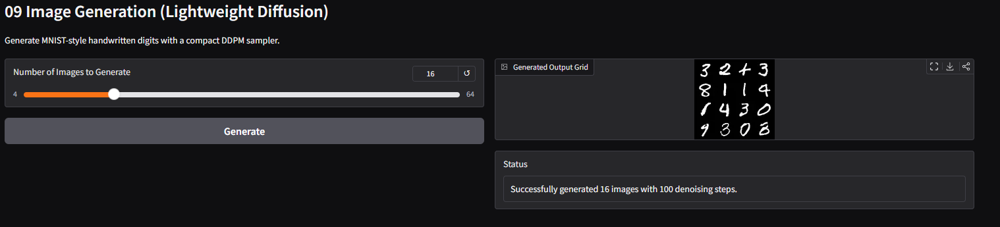

# 深度学习十大经典任务 (Deep Learning 10 Classic Tasks)

本项目整合了深度学习领域中覆盖**计算机视觉 (CV)**、**自然语言处理 (NLP)**、**语音处理 (Audio)** 与**时间序列分析 (TimeSeries)** 的 10 个经典任务。

每个任务采用统一的 **train -> inference -> app** 三层解耦架构，训练完成后可独立启动 Gradio Web 界面查看效果。

---

## 1. 任务选型
所有任务都会选用轻量级模型或截断后的小样本经典数据集：

| 编号 | 任务名称 | 领域 | 使用模型 | 数据集 | 训练模式 |
| :---: | :--- | :---: | :--- | :--- | :---: |
| **01** | 图像分类 | CV | ResNet18 | CIFAR-10 (50000张) | 微调 |
| **02** | 目标检测 | CV | Faster R-CNN (MobileNetV3) | PennFudanPed (170张) | 微调 |
| **03** | 语义分割 | CV | FCN-ResNet50 | Oxford-IIIT Pet (取200张) | 微调 |
| **04** | 情感分析 | NLP | BERT-base-chinese | ChnSentiCorp（完整训练/验证/测试集） | 微调 |
| **05** | 机器翻译 | NLP | opus-mt-en-fr (Transformer) | opus_books en-fr (取500条) | 微调 |
| **06** | 命名实体识别 | NLP | DistilBERT (TokenCls) | CoNLL-2003 (取500条) | 微调 |
| **07** | 文本摘要 | NLP | T5-small | CNN/DailyMail (取500条) | 微调 |
| **08** | 语音识别 | Audio | M5 (自定义CNN) | SpeechCommands (取1000条) | 从零训练 |
| **09** | 图像生成 | CV | DCGAN (自定义GAN) | MNIST (取2000张) | 从零训练 |
| **10** | 时间序列预测 | TimeSeries | LSTM (自定义) | Airline Passengers (144条) | 从零训练 |

---

## 3. 硬件要求与 AutoDL 镜像选择

AutoDL 服务器运行。每个任务使用独立的 Conda 虚拟环境，实现依赖完全隔离。
**AutoDL 基础镜像：**
- **框架**：`Miniconda`
- **Python环境**：由各任务 `environment.yml`指定
- **系统**：`Ubuntu 22.04`

---

## 4. 环境部署

### 一、创建所有环境

```bash
#创建所有conda环境
cd deep-learning-classic-tasks
bash setup_envs.sh

#按需创建conda环境
bash setup_envs.sh --task 1
python start_train.py --task 1 --setup
```

### 二、环境管理命令

```bash
bash setup_envs.sh --list
bash setup_envs.sh --task 1 --force
bash setup_envs.sh --clean
```

---

## 5. 项目结构概览

```text
deep-learning-classic-tasks/
├── README.md                      # 项目总说明文档
├── requirements.txt               # 通用依赖补充
├── setup_envs.sh                  # 批量创建 Conda 环境
├── start_train.py                 # 统一训练入口
├── start_ui.py                    # 统一 Gradio 展示入口
├── AutoDL_UI_Usage.md             # AutoDL 使用说明
├── docs/results/                  # 各任务推理样例与展示素材
├── Log/                           # 训练与运行日志
├── 01_image_classification/       # 任务 01：图像分类
│   ├── environment.yml            # 任务 01 独立环境定义
│   ├── train.py                   # 模型训练脚本
│   ├── inference.py               # 单样本/批量推理逻辑
│   ├── app.py                     # Gradio 可视化界面
│   ├── data/                      # 数据集或缓存文件
│   └── models/                    # 训练得到的模型权重
├── 02_object_detection/           # 任务 02：目标检测
├── 03_semantic_segmentation/      # 任务 03：语义分割
├── 04_sentiment_analysis/         # 任务 04：情感分析
├── 05_machine_translation/        # 任务 05：机器翻译
├── 06_named_entity_recognition/   # 任务 06：命名实体识别
├── 07_text_summarization/         # 任务 07：文本摘要
├── 08_speech_recognition/         # 任务 08：语音识别
├── 09_image_generation/           # 任务 09：图像生成
└── 10_time_series_forecasting/    # 任务 10：时间序列预测
```

> 每个任务子目录内部结构基本一致，通常包含 `environment.yml`、`train.py`、`inference.py`、`app.py`、`data/`、`models/`。上面仅展开 `01_image_classification/` 作为示例。

---

## 6. 如何运行

### 第一步：训练模型

```bash
python start_train.py --task 1 
python start_train.py --task all --setup
```

### 第二步：启动展示界面

#### 推荐方式：统一控制台

```bash
python start_ui.py
```

说明：
- `start_ui.py` 会自动检查当前环境是否有 `gradio`
- 如果当前环境没有 `gradio`，会自动切换到一个可用的 `dl_taskXX` Conda 环境重新启动自己
- 控制台固定监听 `6008`
- 实际任务页面固定监听 `6006`
- 同一时间只允许一个任务占用 `6006`
- 切换任务时，控制台会先停止上一个任务，并等待 `6006` 端口真正释放，再启动下一个任务

推荐访问顺序：
1. 打开 `6008` 对应的本地地址或 AutoDL 公网映射地址
2. 在控制台里选择要展示的任务
3. 再打开 `6006` 对应地址查看当前任务页面

#### 兼容方式：直接启动单任务

```bash
python start_ui.py --task 4
python start_ui.py --task 10 --setup
```

这会直接启动指定任务，不经过统一控制台。

---

## 7. AutoDL 公网映射与已知问题

### 端口约定
- `6008`：统一控制台
- `6006`：当前实际任务页面

### AutoDL 下的代理问题

在 AutoDL 环境中，Gradio 启动时可能访问：
- `http://localhost:6006/gradio_api/startup-events`
- `http://localhost:6008/gradio_api/startup-events`

如果实例环境中的代理变量影响了 `localhost`，Gradio 可能会返回 `502` 并退出。

当前仓库已经在 `start_ui.py` 和各任务 `app.py` 中内置：

```bash
NO_PROXY=127.0.0.1,localhost
no_proxy=127.0.0.1,localhost
```

用于避免本机回环地址走代理。

### 任务切换时的端口释放问题

任务切换时，旧任务虽然已经收到停止信号，但 `6006` 端口不一定会立刻释放。
如果新任务过早启动，会报：

```text
OSError: Cannot find empty port in range: 6006-6006
```

当前 `start_ui.py` 已修复这一点：会等待 `6006` 真正释放后再启动新任务。

### 任务 04 的特殊点

任务 04 的权重目录位于：

```text
/root/autodl-tmp/04_sentiment_analysis/models/bert_chinese_sentiment
```

因此任务 04 的 `app.py` 额外做了默认权重路径修复。其他任务没有改动模型或数据路径。

更详细的 AutoDL 使用说明见 [AutoDL_UI_Usage.md](./AutoDL_UI_Usage.md)。
---

## 10. 推理效果展示

本节按“每个任务一个可运行演示用例”的方式组织，只展示推理结果，不展示训练曲线。
你后续只需要把图片放到对应的 `docs/results/<task_name>/` 目录，并替换下方占位内容即可。

### 10.1 结果素材目录约定

```text
docs/
└── results/
    ├── 01_image_classification/
    │   ├── sample_01.png
    │   └── sample_02.png
    ├── 02_object_detection/
    │   └── sample_01.png
    ├── 03_semantic_segmentation/
    │   └── sample_01.png
    ├── 04_sentiment_analysis/
    │   └── README.md
    ├── 05_machine_translation/
    │   └── README.md
    ├── 06_named_entity_recognition/
    │   └── README.md
    ├── 07_text_summarization/
    │   └── README.md
    ├── 08_speech_recognition/
    │   └── README.md
    ├── 09_image_generation/
    │   └── sample_01.png
    └── 10_time_series_forecasting/
        └── sample_01.png
```

说明：
- 图像类任务直接放 `.png` 推理结果图
- NLP / Audio 任务优先在对应目录的 `README.md` 中放表格或样例输出
- 首页 README 只放最关键的 1 个样例，避免过长

### 10.2 各任务推理效果展示

#### Task 01 图像分类
- 启动：`python start_ui.py --task 1`
- 用例：上传一张常见物体图片，如猫、狗、汽车
- 预期：返回类别预测标签与概率，页面无报错

推理结果示例：


留空说明：
- 这里贴 1 到 2 张分类结果图
- 图中建议直接显示输入图、预测类别、置信度

#### Task 02 目标检测
- 启动：`python start_ui.py --task 2`
- 用例：上传包含 1 到 3 个人体目标的街拍图
- 预期：输出图中有检测框与类别，至少能框出主要目标

推理结果示例：


留空说明：
- 这里贴 1 张检测结果图
- 图中建议直接叠加 bbox、类别名、置信度

#### Task 03 语义分割
- 启动：`python start_ui.py --task 3`
- 用例：上传含前景目标的图片，如宠物或人像
- 预期：输出分割掩码或叠加图，前景区域有明显分割结果

推理结果示例：


留空说明：
- 这里贴 1 张分割可视化结果
- 建议展示原图与 mask 叠加效果

#### Task 04 情感分析
- 启动：`python start_ui.py --task 4`
- 用例：
  - 正向文本：`This movie is wonderful and touching.`
  - 负向文本：`This is boring and a waste of time.`
- 预期：分别输出正向 / 负向倾向
- 备注：若提示模型不存在，需先补训 task4

推理结果示例：

| Input | Prediction | Score |
| :--- | :---: | :---: |
| This movie is wonderful and touching. | 待填写 | 待填写 |
| This is boring and a waste of time. | 待填写 | 待填写 |

留空说明：
- 你可以把完整结果放到 `docs/results/04_sentiment_analysis/README.md`

#### Task 05 机器翻译
- 启动：`python start_ui.py --task 5`
- 用例：`I love deep learning and computer vision.`
- 预期：输出法语翻译文本，语义基本正确

推理结果示例：

| Source | Prediction | Reference |
| :--- | :--- | :--- |
| I love deep learning and computer vision. | 待填写 | 可选 |

留空说明：
- 若有多条例子，建议整理到 `docs/results/05_machine_translation/README.md`

#### Task 06 命名实体识别
- 启动：`python start_ui.py --task 6`
- 用例：`Barack Obama visited Paris in 2015.`
- 预期：识别出人名、地点、时间等实体标签

推理结果示例：

| Input | Entities |
| :--- | :--- |
| Barack Obama visited Paris in 2015. | 待填写 |

留空说明：
- 建议把实体写成 `Barack Obama(PER), Paris(LOC), 2015(DATE)` 这类格式

#### Task 07 文本摘要
- 启动：`python start_ui.py --task 7`
- 用例：输入一段 8 到 12 句英文新闻文本
- 预期：输出更短摘要，保留主要信息点

推理结果示例：

| Input Article | Summary |
| :--- | :--- |
| 待粘贴原文片段 | 待填写摘要 |

留空说明：
- README 首页放 1 条即可，更多样例可写入 `docs/results/07_text_summarization/README.md`

#### Task 08 语音识别
- 启动：`python start_ui.py --task 8`
- 用例：上传 1 秒英文命令词音频，如 `yes`、`no`、`up`、`down`
- 预期：输出命令类别
- 备注：当前任务 8 未完成训练，若失败属预期，待训练完成后复测

推理结果示例：

| Audio | Prediction | Ground Truth |
| :--- | :--- | :--- |
| sample_01.wav | 待填写 | yes |

留空说明：
- 当前可以先保留表格占位，后续训练完成再补真实结果

#### Task 09 图像生成
- 启动：`python start_ui.py --task 9`
- 用例：点击生成，或输入随机种子后生成
- 预期：生成手写数字风格图像，可见数字轮廓

推理结果示例：



留空说明：
- 这里贴 1 张生成结果拼图最合适
- 若支持随机种子，建议在图注里标明 seed

#### Task 10 时间序列预测
- 启动：`python start_ui.py --task 10`
- 用例：使用默认历史序列，预测未来若干步
- 预期：输出预测曲线，趋势与历史序列连续、平滑

推理结果示例：


留空说明：
- 这里贴 1 张预测曲线图
- 建议在同一张图中展示历史序列、预测段、真实值或基准线

### 10.3 如何让结果更像“真实推理输出”

建议统一遵循下面几条：
- 图像分类：图上直接标出 `label + score`
- 检测任务：图上直接标出 `bbox + class + score`
- 分割任务：显示原图与 mask 叠加图
- 文本任务：统一使用 `Input / Prediction / Reference` 表格
- 语音任务：展示音频文件名、预测类别、真实标签
- 时序任务：同图展示历史窗口和预测结果
- 每个任务的说明里写明“结果来自 `python start_ui.py --task X` 的实际推理”
