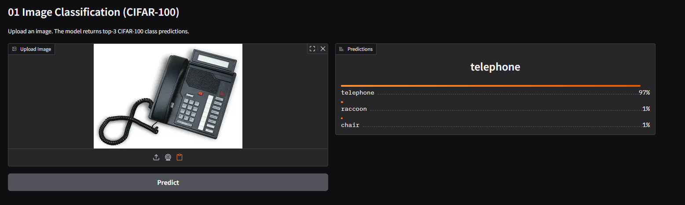
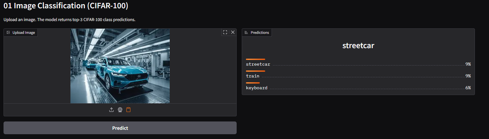
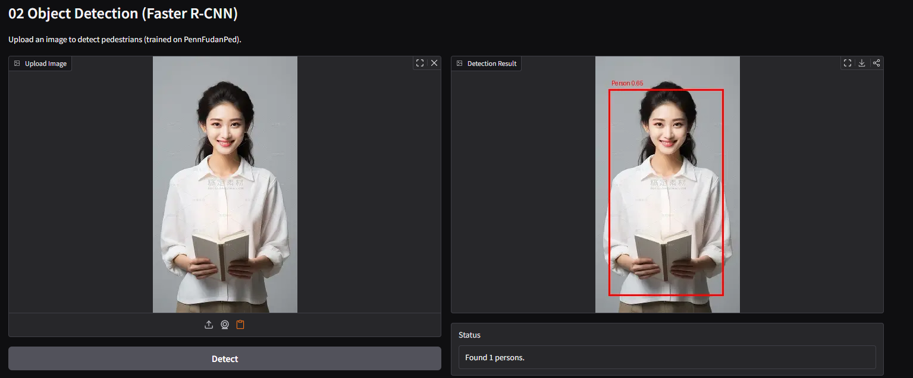
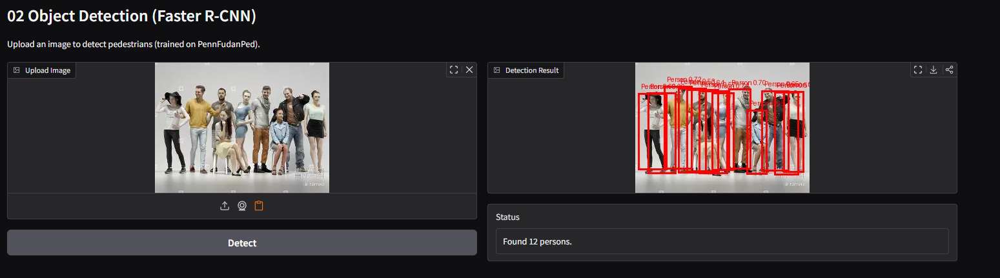
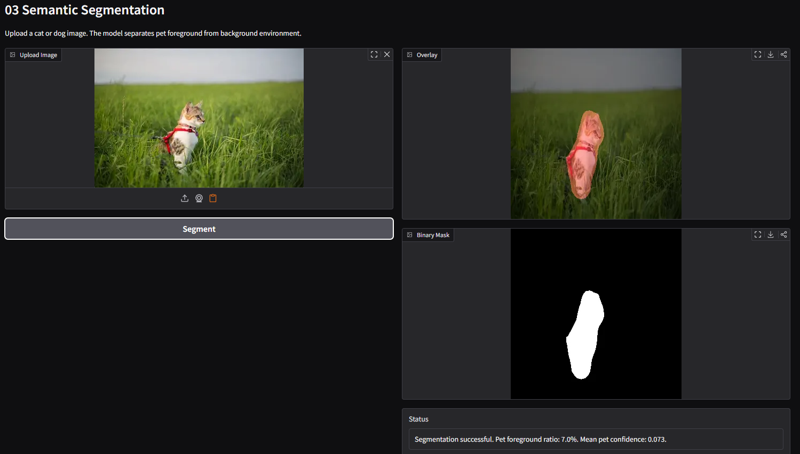
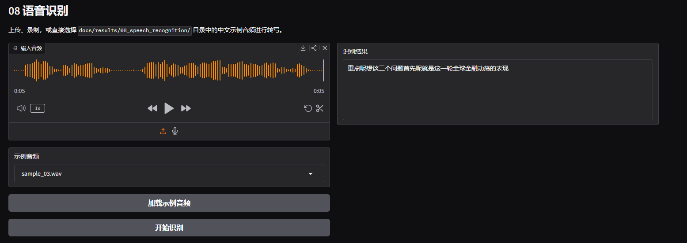
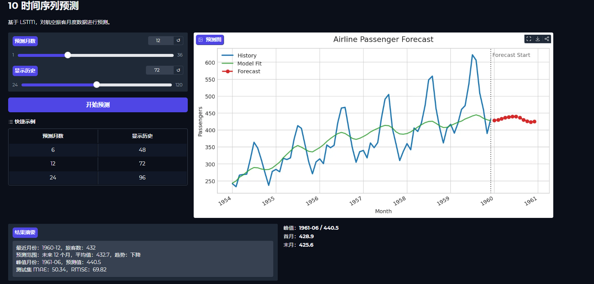

# 深度学习十大经典任务

本项目整合了深度学习领域中覆盖 **计算机视觉（CV）**、**自然语言处理（NLP）**、**语音处理（Audio）** 与 **时间序列分析（Time Series）** 的 10 个经典任务。

每个任务采用统一的 **train -> inference -> app** 三层解耦架构。训练完成后，可以独立启动 Gradio Web 界面查看效果。

## 1. 任务选型

所有任务优先选用轻量级模型，或对经典数据集做小样本截断，以保证项目更容易训练、部署和演示。

| 编号 | 任务名称 | 领域 | 使用模型 | 数据集 | 训练模式 |
| :---: | :--- | :---: | :--- | :--- | :---: |
| **01** | 图像分类 | CV | ResNet18 | CIFAR-10（50000 张） | 微调 |
| **02** | 目标检测 | CV | Faster R-CNN（MobileNetV3） | PennFudanPed（170 张） | 微调 |
| **03** | 语义分割 | CV | FCN-ResNet50 | Oxford-IIIT Pet（取 200 张） | 微调 |
| **04** | 情感分析 | NLP | BERT-base-chinese | ChnSentiCorp（完整训练/验证/测试集） | 微调 |
| **05** | 机器翻译 | NLP | opus-mt-en-fr（Transformer） | opus_books en-fr（取 500 条） | 微调 |
| **06** | 命名实体识别 | NLP | 中文 BERT NER（CKIP） | 中文预训练实体识别模型 | 本地缓存 |
| **07** | 文本摘要 | NLP | Randeng-T5 中文多任务模型 | LCSTS 中文摘要数据集（取 1000 条） | 微调 |
| **08** | 中文语音转写 | Audio | Whisper-small | 中文语音音频 | 预训练推理 |
| **09** | 图像生成 | CV | 轻量级扩散模型（自定义 DDPM） | MNIST（60000 张） | 从零训练 |
| **10** | 时间序列预测 | Time Series | LSTM（自定义） | Airline Passengers（144 条） | 从零训练 |

## 2. 项目结构概览

```text
deep-learning-classic-tasks/
├── README.md
├── setup_envs.sh                  # 批量创建 Conda 环境
├── start_train.py                 # 统一训练入口
├── start_ui.py                    # 统一 Gradio 展示入口
├── docs/results/                  # 推理样例与展示素材
├── 01_image_classification/       # 任务 01：图像分类
│   ├── environment.yml            # 任务 01 独立环境定义
│   ├── train.py
│   ├── inference.py               # 推理逻辑
│   ├── app.py                     # Gradio 可视化界面
│   ├── data/                      # 数据集
│   └── models/                    # 模型权重
├── 02_object_detection/           # 任务 02：目标检测
├── 03_semantic_segmentation/      # 任务 03：语义分割
├── 04_sentiment_analysis/         # 任务 04：情感分析
├── 05_machine_translation/        # 任务 05：机器翻译
├── 06_named_entity_recognition/   # 任务 06：命名实体识别
├── 07_text_summarization/         # 任务 07：文本摘要
├── 08_speech_recognition/         # 任务 08：语音识别
├── 09_image_generation/           # 任务 09：图像生成
└── 10_time_series_forecasting/    # 任务 10：时间序列预测
```

> 每个任务子目录内部结构基本一致。

## 3. 环境部署

项目默认运行在 AutoDL 服务器上。每个任务使用独立的 Conda 虚拟环境，实现依赖隔离。

**AutoDL 基础镜像：**
- **框架：** `Miniconda`
- **Python 环境：** 由各任务 `environment.yml` 指定。
- **系统：** `Ubuntu 22.04`


### 3.1 创建所有环境

```bash
cd deep-learning-classic-tasks
bash setup_envs.sh
```

### 3.2 按需创建单个环境

```bash
bash setup_envs.sh --task 1
python start_train.py --task 1 --setup
```

### 3.3 环境管理命令

```bash
bash setup_envs.sh --list
bash setup_envs.sh --task 1 --force
bash setup_envs.sh --clean
```

## 4. 运行

### 4.1 训练模型

```bash
python start_train.py --task 1
python start_train.py --task all --setup
```

### 4.2 启动展示界面

```bash 
python start_ui.py
python start_ui.py --task 4
python start_ui.py --task 10 --setup
```

## 6. 各任务推理效果展示

### Task 01：图像分类
- 用例：上传一张常见物体图片，如猫、狗、汽车。
- 预期：返回类别预测标签与概率，页面无报错。

推理结果示例：




### Task 02：目标检测
- 用例：上传包含 1 到 3 个人体目标的街拍图。
- 预期：输出图中有检测框与类别，至少能框出主要目标。

推理结果示例：




### Task 03：语义分割
- 用例：上传一张包含猫或狗的图片。
- 预期：输出宠物前景与背景环境的二分类分割结果，展示 overlay 与二值 mask。

推理结果示例：



### Task 04：情感分析
- 用例：
  - 正向文本 1：这部电影真是太棒了，剧情紧凑，画面唯美，强烈推荐！
  - 正向文本 2：本来只是勉强陪朋友去尝尝鲜，结果最后光盘的反而全是我。
  - 负向文本 1：简直是浪费时间，剧情烂透了，演员演技也很尴尬。
  - 负向文本 2：外包装看着确实挺有设计感的，不过也就只剩下包装能看了。
- 预期：判断文本情感倾向，并输出预测标签与置信度。

推理结果示例：

| Input | Prediction | Score |
| :--- | :---: | :---: |
| 这部电影真是太棒了，剧情紧凑，画面唯美，强烈推荐！ | 积极 | 97% |
| 本来只是勉强陪朋友去尝尝鲜，结果最后光盘的反而全是我。 | 消极 | 95% |
| 简直是浪费时间，剧情烂透了，演员演技也很尴尬。 | 消极 | 99% |
| 外包装看着确实挺有设计感的，不过也就只剩下包装能看了。 | 积极 | 58% |

### Task 05：机器翻译
- 用例：
I love deep learning and computer vision.
Deep learning is a subset of machine learning.
This project uses a Transformer model for translation.
- 预期：输出法语翻译文本，语义基本正确。

推理结果示例：

| Source | Prediction |
| :--- | :--- |
| I love deep learning and computer vision. | J'aime l'apprentissage approfondi et la vision informatique. |
| Deep learning is a subset of machine learning. | L'apprentissage approfondi est un sous-ensemble d'apprentissage m�canique. |
| This project uses a Transformer model for translation. | Ce projet utilise un mod�le transformateur pour la traduction. |

### Task 06：命名实体识别
- 用例：
  - `李雷明天早上 8 点要飞往北京参加腾讯的面试。`
  - `《流浪地球》是由郭帆执导的一部科幻电影，于 2019 年在中国大陆上映。`
  - `小米集团今天在北京发布新产品，雷军表示今年研发投入将超过300亿元。`
  - `华为与上海交通大学将在 2026 年继续推进联合实验室合作。`
- 预期：识别出人名、机构、地点、日期、金额等实体标签。

推理结果示例：

| Input | Entities |
| :--- | :--- |
| 李雷明天早上 8 点要飞往北京参加腾讯的面试。 | 李雷(PERSON), 明天(DATE), 早上8点(TIME), 北京(GPE), 腾讯(ORG) |
| 《流浪地球》是由郭帆执导的一部科幻电影，于 2019 年在中国大陆上映。 | 流浪地球(WORK_OF_ART), 郭帆(PERSON), 2019年(DATE), 中国大陆(GPE) |
| 小米集团今天在北京发布新产品，雷军表示今年研发投入将超过300亿元。 | 小米集团(ORG), 今天(DATE), 北京(GPE), 雷军(ORG), 今年(DATE), 300亿元(MONEY) |
| 华为与上海交通大学将在 2026 年继续推进联合实验室合作。 | 华为(ORG), 上海交通大学(ORG), 2026年(DATE) |


### Task 07：文本摘要
- 用例：输入一段 8 到 12 句中文新闻或说明文本。
- 预期：生成保留主要信息点的中文摘要。

推理结果示例：

| Input Article | Summary |
| :--- | :--- |
| 近日，多地加快推进“人工智能+”应用落地。媒体报道显示，人工智能正在从智能制造的自动化生产线、医疗辅助诊疗、教育互动课堂等场景持续扩展。工信部此前数据显示，我国人工智能相关企业已超过4500家，核心产业规模接近6000亿元。与此同时，行业大模型数量持续增加，覆盖教育、金融、办公、政务、医疗等多个领域。业内人士认为，随着应用场景不断丰富，人工智能正在成为推动产业升级和形成新质生产力的重要力量。 | 工信部:人工智能将从智能制造的自动化生产线、医疗辅助诊疗、教育互动课堂等场景扩展 |
| 中国新能源汽车产业继续保持全球领先。根据中国汽车工业协会公布的数据，2025年新能源汽车产销分别达到1662.6万辆和1649万辆，同比分别增长29%和28.2%。新能源汽车新车销量占汽车新车总销量的比重接近一半，动力电池、智能座舱和辅助驾驶等关键技术也在持续进步。多项促消费和下乡政策进一步释放了市场需求，带动国内产销和出口同步增长。业内认为，技术突破与政策支持共同推动了新能源汽车产业迈上新台阶。 | 中国汽车产业继续保持全球领先:汽车新车销量占总销量的比重接近一半 |


### Task 08：中文语音转写
- 用例：上传或录制一段中文语音。
- 预期：输出对应的中文转写文本。

推理结果示例：

| Audio | Prediction | Ground Truth |
| :--- | :--- | :--- |
| sample_01.wav | 对我做了介绍。啊,那么我想说的是，大家如果对我的研究感兴趣呢， | 对我做了介绍啊那么我想说的是呢大家如果对我的研究感兴趣呢 |
| sample_03.wav | 重点呢,想谈三个问题。首先呢，就是这一轮全球金融动荡的表现。| 重点呢想谈三个问题首先呢就是这一轮全球金融动荡的表现。|



### Task 09：图像生成
- 用例：在 Gradio 页面中将生成数量设为 `16`，
- 预期：随机生成一张 `4 x 4` 拼图，共 `16` 个 MNIST 风格手写数字图像；数字类别随机，不支持指定只生成某个数字（例如仅生成 `9`）。

推理结果示例：


当前任务是无条件生成，随机采样数字分布。

### Task 10：时间序列预测
- 用例：使用默认历史序列，预测未来若干步。
- 预期：输出预测曲线，趋势与历史序列连续、平滑。

推理结果示例：
